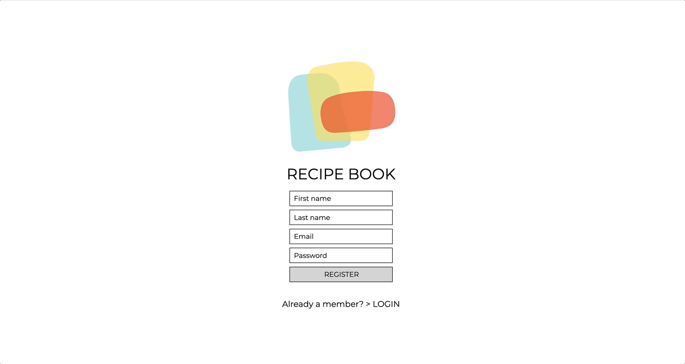
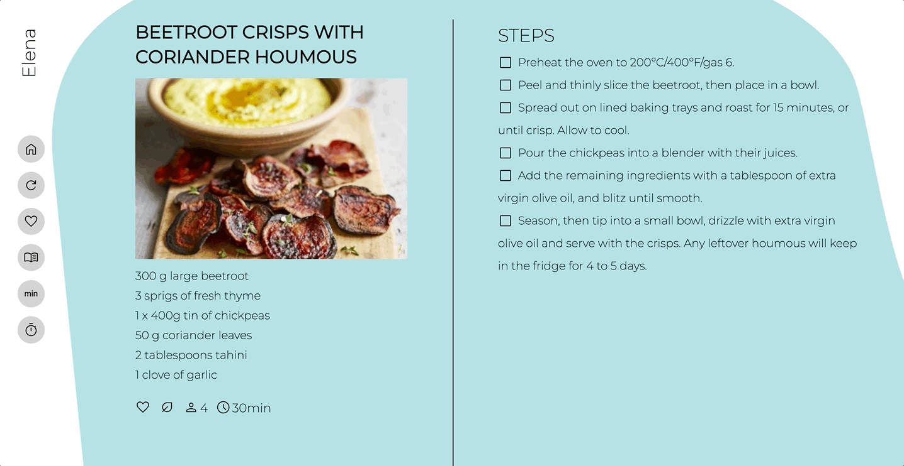
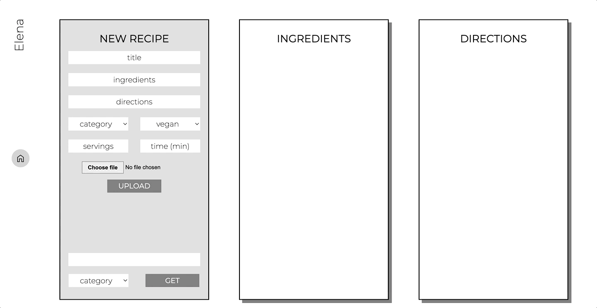

# recipe-book

*project done during the SPICED academy Full Stack Web Development bootcamp*  

## overview  
Recipe Book is a central location where users can store and organise their favourite recipes. They can search and filter them and have some helpful tools while cooking. It has a very minimalistic layout, all functionalities are placed as icons on the left handside for a clean easy-to-use design.

- Registration and Login page with error display
- Bcrypt for password protection
- Recipes are organised in three main categories and displayed alphabetically
- Filtering through recipes available (depending if they are favourited or vegan)
- Recipe preview on click (image, ingredients, basic data)
- Further functionalities while cooking: timer, steps can be crossed out as they are completed
- Recipes can be modified and erased
- Users can prepare menus (by joining some recipes) and generate a grocery list
- The insertion of recipes can be done manually or via a scraper, supported on some webpages

Note: This website is not yet optimised for small screens, please take a look on a laptop or a bigger screen.  

## previews  

**register & login page**  
minimalistic approach with all basic functionalities and error displays
&nbsp;

<kbd></kbd>

**filter through recipes**  
recipes organised alphabetically, filters, preview of each recipe
&nbsp;

<kbd></kbd>

**recipe functionalities**  
timer function, cross out steps
&nbsp;

<kbd></kbd>

**new recipe > manual input**  
manual input and categorisation of recipes  
&nbsp;

<kbd></kbd>

**new recipe > scrape**  
automatic input with a scraper (recipes in our page are for personal use only)
&nbsp;

<kbd></kbd>
