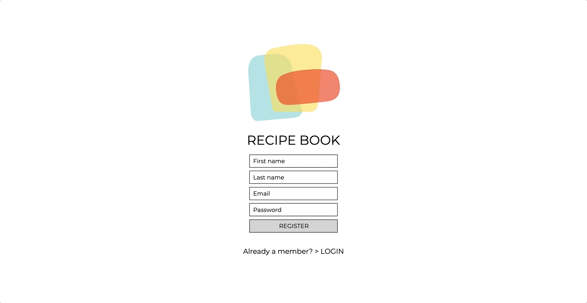

# recipe-book

**register & login page**  
minimalistic approach with all basic functionalities and error displays

**filter through recipes**  
recipes organised alphabetically, filter favourites & vegan recipes, preview of each recipe

**recipe functionalities**  
timer function, update recipe, add to menu, make favourite, cross out steps

**menu and groceries list**  
generate a groceries list with the combined ingredients from all selected recipes

**new recipe > manual input**  
manual input and categorisation of recipes  

**new recipe > scrape**  
automatic input with a scraper (recipes in our page are only for personal use)

